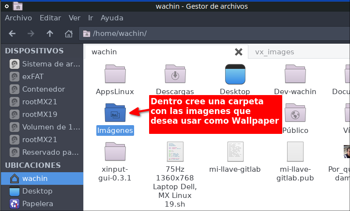
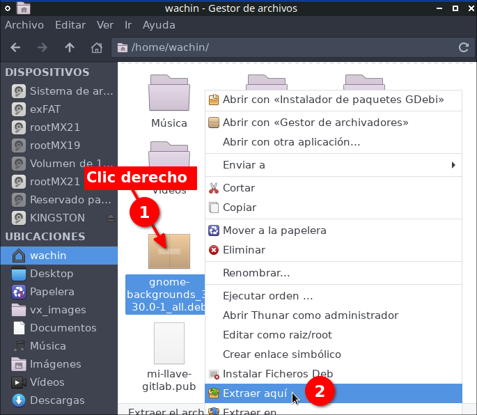

# RisenPC-Fluxbox-ES
Fluxbox personalizado en español para Ordenadores con pocos recursos

Si bien es cierto MX Linux 21 tiene una versión con Fluxbox no me gusta cómo la han hecho, ejemplo ellos han reemplazado la barra de tareas que si tiene Fluxbox por la de un programa, yo prefiero usar la que tiene Fluxbox

# Requerimientos
Se requiere lo sigiente:

- MX Linux 21 versión XFCE de 32 o 64 bits

**Nota:** Pero también se puede instalar en MX 19 u otro superior de MX Linux

**Descargar MX Linux desde:**

[https://sourceforge.net/projects/mx-linux/files/Final/Xfce/](https://sourceforge.net/projects/mx-linux/files/Final/Xfce/)  

redirigido desde (donde están las ISO más actuales):

[https://mxlinux.org/download-links/](https://mxlinux.org/download-links/)  

**Explicación.-** Esta versión de MX Linux XFCE no trae instalado la versión de Fluxbox MX Linux por lo cual allí podremos usar estas configuraciones (digo esto porque MX Linux tiene una versión de Fluxbox pero yo no la uso porque no me gusta). Además es importante tomar en cuenta que todo este tutorial está diseñado para MX Linux 21 por lo que si lo desea usar en otro Sistema Operativo Linux deberá modificarlo muy seguramente.

# Instalación de Fluxbox y dependencias
Este tutorial ha sido hecho en MX Linux 21 la versión XFCE. Con lo siguiente nos aseguraremos de habilitar lo más basico además de dejar configuradas las aplicaciones KDE 

**Dependencias**


    sudo apt-get install git fluxbox lxappearance lxrandr pnmixer numlockx \
    xfce4-appfinder xfce4-notes gnome-terminal qt5ct nitrogen \
    breeze gnome-icon-theme gxkb thunar gammy

dele Enter y poner "s" de que si acepta

**Nota:** Para instalarlo en MX Linux 19 debe quitar el paquete gammy.   

# Borre los estilos del paquete de Fluxbox  

El comando anterior instalará fluxbox pero ese trae unos temas muy feos, yo nunca los uso, yo los borro, le recomiendo hacer lo mismo, ponga en la terminal:

```
sudo rm -fr /usr/share/fluxbox/styles/
```

No se preocupe aquí usaremos los de MX Fluxbox

# Borrar los archivos originales de Fluxbox si Ud los usaba
Si usted estaba usando Fluxbox debe haber una carpeta escondida (Si no es este su caso omita este paso) , veala con Ctrl + H

.fluxbox

esa carpeta hay que borrarla si es que la tenía, así:

```
sudo rm -fr ~/.fluxbox
```

# Instalar RisenPC Fluxbox Español
A continuación les dejaré dos maneras de instalar RisenPC Fluxbox ES, la primera es para un usuario normal:

## Instalar RisenPC Fluxbox Español para usuario normal
Abra una terminal y:


copie todo de una sola vez (Terminales como XFCE4-Terminal o Konsole admiten pegar todo de una sola vez) (también si no le funciona copie uno por uno):

```
    git clone https://github.com/wachin/RisenPC-Fluxbox-ES
    mv RisenPC-Fluxbox-ES ~/.fluxbox
    cd .fluxbox
    mkdir -p ~/.config/pnmixer/
    cp config ~/.config/pnmixer/ && cd && echo "Dios les bendiga"
```

peguelo en una terminal como lo indica la imagen anterior y ejecutelo
    
**Explicación**  
1er línea.- Clona el repositorio  
2da línea.- Mueve el repositorio entero allí mismo en su HOME cambiandole el nombre a .fluxbox  
3ra línea.- Entra en la carpeta oculta .fluxbox  
4ra línea.-  Crea la carpeta pnmixer (si ya estuviera no)  
5ta línea.- Copia y pega el archivo config de pnmixer que puse dentro de la carpeta .fluxbox que contiene la instrucción "pavucontrol" para que al darle clic y dar clic en elbotón "Mixer" aparezca el control de volumen. **Nota:** También se lo podría Ud poner manualmente así: Clic derecho al icono --> Preferences --> Behavior --> Volume Control Command y allí añadir: "pavucontrol"  

Por cierto, en la terminal quedarán ubicados en .fluxbox pero pueden salir de allí con cd.


## Instalar RisenPC Fluxbox Español para Desarrolladores
Esta es la segunda manera de instalar RisenPC Fluxbox si usted es un desarrollador y desea cambiar el funcionamiento de este proyecto le recomiendo instalarlo de otra manera, de clic en el siguiente enlace:

[RisenPC-for-DEV.md](RisenPC-for-DEV.md)


# Configurar qt5ct utilidad de configuración de Qt5
Esto es necesario para las aplicaciones que han sido escritas en Qt (KDE) como por ejemplo Dolphin, Kate, etc para poder elegir los iconos y temas de ellas

Ponga en una terminal:

```
 echo "export QT_QPA_PLATFORMTHEME="qt5ct"" >> ~/.profile
```

Con esto hemos añadido esa última línea al archivo oculto .profile


# Instalar Menú de aplicaciones con iconos, con xdgmenumaker
El siguiente programa necesario se llama xdgmenumaker, que me gustaría que lo pongan dentro de alguna carpeta aparte, yo estoy usando:

🗀AppsLinux

usted puede crearla manualmente:


o también lo podría hacerlo desde una terminal con los siguientes comandos:

```
mkdir -p ~/AppsLinux
cd ~/AppsLinux
```

de cualquier manera si lo haga manual o desde la terminal, luego instale los paquetes:

```
sudo apt-get install txt2tags python3-xdg gobject-introspection
```
y luego clone el programa xdgmenumaker y entre en su directorio:

```
git clone https://github.com/gapan/xdgmenumaker && cd xdgmenumaker
```
después haga make:

```
make
```

y hagase super usuario (ponga su contraseña):

```
sudo su 
```
en la siguiente imagen verá usted hasta donde debe usted estar ubicado:


y luego poner lo siguiente:

```
make install && cd .. && exit
```

aquí un captura:


Con esto tendrá iconos de la mayoría de las aplicaciones en el menú de fluxbox

**Nota**: Si lo sedea puede borrar la carpeta xdgmenumaker

    sudo rm -fr xdgmenumaker


## Creando el Menu de fluxbox, con xdgmenumaker

Antes de hacer esto debe:

**Reiniciar y entrar en la sesión de Fluxbox**


la anterior y la siguiente imagen son de MX Linux 19:


una vez que ha entrado, ponga en una terminal:

    xdgmenumaker -i -s16 -f fluxbox > ~/.fluxbox/xdg_menu

esto es necesario hacerlo sólo una vez

En ese archivo xdg_menu se escribirán todas las aplicaciones que están instaladas en su sistema para que estén disponibles para el menú de Fluxbox 

Para ver el menú de clic derecho en el escritorio o clic derecho en una de las dos esquinas o Super + M quedará así:


## Actualizar el menú de Fluxbox cada vez que instale alguna aplicación
Esto debe saberlo pues en esta instalación se utiliza a xdgmenumaker pero hay que actualizar el menu después que uno instala alguna aplicación, para hacerlo clic en:

**Actualizar menu de Apps**  


Pero si no desea utilizar este menú sólo use el XFCE4-AppFinder


# Control de volumen
Clic en el control de volumen:  


y clic en "Mixer"  


y se abrirá el control de volumen:  


# Temas de iconos para aplicaciones KDE (Qt)

Para estas aplicaciones se recomienda usar

Breeze  
Papuris  
Oxygen  

se configura en:

**Menú --> Herramientas --> Ajustes Qt "Aplicaciones KDE"**  


**Nota:** El menú principal de Fluxbox se lo puede abrir desde escritorio con clic derecho, o en las esquinas abajo izquierda o derecha abajo, o con el atajo de teclado Super + M

Esperar un poco hasta que se abran los ajustes de QT

y allí en la pestaña:

**Tema de iconos**

Seleccionar **Papirus**  


este tema además es compatible con 

Dolphin  

como se explica con más detalle en:  

**Cambiar colores en carpetas de Dolphin (Administrador de archivos) en MX Linux 21, antiX 21 basados en Debian 11 Bullseye, y Ubuntu 22.04 y otros con "Dolphin Folder Color"**  
[https://facilitarelsoftwarelibre.blogspot.com/2022/05/cambiar-colores-en-carpetas-de-dolphin-con-dolphin-folder-color-en-debian-11-ubuntu-22.04.html](https://facilitarelsoftwarelibre.blogspot.com/2022/05/cambiar-colores-en-carpetas-de-dolphin-con-dolphin-folder-color-en-debian-11-ubuntu-22.04.html)  

## El tamaño de las fuentes de las aplicaciones QT

Allí mismo en el configurador QT de clic en la pestaña:

**Tipos de letra**  


allí arriba como se ve en la imagen cambiar el tamaño de las fuentes:  


después dar clic en Aplicar luego en Aceptar y cerrar la aplicación escrita en QT ejemplo Kate, Dolphin u otra y vuelvala a abrir y ya tendrán las fuentes otro tamaño, o si cambió la fuente estará usando otra, allí como ve yo le he puesto:

**DejaVu Sans** - **Book** - **11**

pero usted puede elegir otro tipo, estilo, tamaño

como puede ser:  


y lo dejo así:  


y allí le di clic en Aceptar y Aplicar y reinicié la aplicación Qt que necesitaba.

# Atajos de teclado

Antes de que vea la configuración de los atajos de teclado, si usted es curioso y luego quisiera editar los atajos para añadir uno (para usuarios avanzados) puede dar clic derecho en algún lugar del escritorio si estuviera sin ninguna aplicación encima o sino de clic derecho a la izquierda abajo del escritorio:  


luego clic en:  


allí yo puse las siguientes configuraciones al archivo .fluxbox/keys  


allí si ustedes quisieran podrían editar eso o poner otros atajos, pero esto es opcional

Ahora si, los atajos

## AppFinder
Para abrir el buscador de aplicaciones AppFinder (xfce4-appfinder)

Tecla Windows + A  


**Nota:** La Tecla de Windows también es conocida como Super, o Mod4 en las configuraciones de los atajos de teclado de Fluxbox. El AppFinder es de XFCE y desde la terminal se lo puede lanzar con xfce4-appfinder


## Abrir menu de aplicaciones
EL siguiente atajo de teclado es para abrir el menu de aplicaciones en cualquier lugar donde esté el cursor, con el atajo de teclado:

Tecla Windows + M

o lo que es lo mismo:

Super + M  


**Nota:** Si no elige ninguna aplicación aplaste ESC para escapar

## Poner una ventana siempre encima
Si usted por ejemplo tiene abierta la terminal y quisiera que ella esté siempre enfrente de las demás ventanas aplaste:

Alt + V

para devolver esa ventana a su estado normal, estando enfrente de la ventana de esa aplicación otra vez dar:

Alt + V

**Nota:** La Tecla Alt se llama Mod1 en las configuraciones de los atajos de teclado de Fluxbox


## Minimizar ventanas
En con las teclas:

Alt + Z

le puse este atajo de teclado porque para mi es más fácil de usar, pero si ustedes quisieran le pueden poner otro

**Nota**: Esto lo modifiqué del archivo "key" en # current window commands donde originalmente tenía:  Mod1 + F9


 ## Minimizar todas las ventanas (no se puede)
 Pngo este título pues yo habría querido que hubiera una manerea de poder minimizar todas las ventanas de programas abiertas como en Windows (Super + D) pero no se puede, aunque se puede minimizando una por una


# Control de brillo para evitar cansancio ocular

Gammy está en los repositorios de MX Linux 21 y si ha hecho esta instalación allí pues ya está instalado pues lo he incluido en el archivo .fluxbox/startup al autoinicio

Ese archivo lo puede abrir desde el menú:  


allí lo puse:  


también lo puede buscar manualmente con el administrador de archivos  usando Ctrl + H para ver los archivos ocultos y buscar la ruta:

.fluxbox/startup

lo puede abrir a ese archivo con algún editor de texto, ejemplo en la siguiente imagen con Geany:  


por lo que cuando usted entre en la sesión, Gammy se abrirá a la derecha abajo entre los iconos, la siguiente imagen es de Gammy en MX Linux 21 (yo lo uso como indico en la imagen):  


**Para Instalarlo en MX Linux 19.-** hay que compilarlo desde el código fuente, ver:

**Compilando gammy 0.9.51 (herramienta para ajustar el brillo / temperatura del monitor) en MX Linux 19**
<https://facilitarelsoftwarelibre.blogspot.com/2022/02/compilando-gammy-en-mx-linux-19.html>

Por cierto para minimizar gammy en MX Linux 19 es así como muestro en la siguiente imagen:  


# Cómo cambiar de Estilo de Fluxbox
Cuando usted cambie de estilo:

En es escritorio clic derecho en el menú, o en las esquinas o Super + M y clic en **Estilos**  


en esta imagen ustedes ven que se ven bien los nombres de los estilos disponibles, sin embargo cuando elijan otro estilo muy posiblemente no se verán bien, para que se vean bien si lo desean pueden cerrar sesión y cuando entren otra vez ya se verán bien las letras, pero esto de cerrar sesión no es necesario de hacerlo del todo, pueden seguir usando Fluxbox y ya en el siguiente ingreso se verá bien.

Por cierto hay algunos de estos temas en lo que al cambiar de tema no se ven todos los estilos disponibles, para arreglar eso de clic:

En es escritorio clic derecho en el menú, o en las esquinas o Super + M y clic en **Reajustar Fluxbox ** 


al hacer eso ya se verán bien todos los estilos disponibles


# Cambiar el idioma del teclado
Yo vivo en el Ecuador en Latinoamérica y uso la Distribución para Español Latino y por eso lo he dejado configurado para usarlo, cic en:

**Menú --> Preferencias > Startup "Aplicaciones que se cargan al inicio" ** 


allí en:  


como ve en esa imagen lo puede cambiar por Español España siguiendo esos pasos, así cada vez que usted inicie su ordenador se cargará ese teclado


## Cambiando el idioma del teclado al vuelo (cambio rápido)
Les he dejado un menú para cambiar rápidamente de teclado

En es escritorio clic derecho en el menú, o en las esquinas o Super + M y clic en **Idioma del teclado ** 


No hay muchos idiomas, pero si ustedes necesiten algún otro me avisan

Esto es util pues imaginese que usted está traduciendo algún documento y quiera cambiar rapido a otro idoma


# Cambiar el wallpaper (Fondo de pantalla)
La primera vez que lo vamos a usar es necesario reiniciar nitrogen, de clic en:

**Menú --> Herramientas --> Resetear  Nitrogen en 1er uso y resetear para usar Dos Monitores**  


esa opción sirve para dos cosas, lo estamos usando para la primera

después de esto si ya pueden dar clic en:

**Menú --> Herramientas --> Cambiar el fondo del escritorio con Nitrogen -imagenes del sistema-  ** 


allí se abrirá nitrogen y podrán cambiar de wallpaper, por defecto abrirá los que están instalados en el sistema. En la siguiente imagen le pongo los pasos para elegir otro:  


solo que en el punto 2 donde dice **Automatic** cambiele a **Scaled**


# Para añadir un fondo de escritorio (Wallpaper) personalizado

Para usar una imagen como Wallpaper, debe crear una capeta en algún lugar, puede ser dentro de la carpeta Imágenes:  



ejemplo:  


le he puesto como nombre Wallpapers y dentro he puesto varios:  


para poder seleccionarlos desde Nitrogen, clic en:

**Menú --> Herramientas --> Cambiar sus fondo de escritorio con Nitrogen -sus imagenes- ** 


luego debo dar clic en Nitrogen en:

**Preferencias ** 


allí añadir la ruta donde están sus Wallpapers:  


así:  


así me queda y doy clic en OK:  


y les pongo la siguiente imagen para que puedan ver Nitrogen ha cargado las imagenes de la carpeta que creé en Imágenes:  


**Nota:** Scaled es para que la imagen ocupe todo el fondo del escritorio si es que no fuera del mismo tamaño y Wallpaper cambiado:  


# Para añadir fondos de escritorio (Wallpaper) de los repositorios (de diferentes distribuciones)

En los repositorios hay varios paquetes de fondos de escritorio de diferentes distribuciones, si uno en Synaptic busca la palabra:

**backgrounds**

encontrará varios paquetes que tienen fondos de escritorio  


allí como ejemplo instalé:

mate-backgrounds

y si busco en los **Archivos instalados**  


quedan instalados en la siguiente ruta:

/usr/share/backgrounds/mate  


pero Nitrogen no los carga

La solución más fácil para mi es marcarlos para instalar:  


y generar un script de descarga:  


el script de descarga por defecto aparecerá para guardarlo dentro de la ubicación:

root


pero yo nunca lo guardo allí (porque después adquieren permisos de super usuario y solo se pueden borrar abriendo un administrador de archivos como root, ejemplo: sudo pcmanfm -pero hay que tener instalado en este ejemplo pcmanfm, u otro administrador de archivos, no recomiendo usar el mismo Thunar por algunas razones-), siempre lo guardo en alguna partición de Windows: NTFS o exFAT, y si usted no tienen ninguna puede poner un Pendrive y guardarlo allí pues generalmente están en formato fat32 o exFAT:


y una vez en el lugar guardado abrir el archivo:


cada una de las lineas generadas en el script:


se pueden descargar desde una terminal una por una, o todas al mismo tiempo:


**Nota:** Hay que esperar hasta que el porcentaje esté al 100% de descarga. En la imagen de arriba el **deb** se descargarán en **HOME**

luego a cada paquete lo puede descomprimir con clic derecho extraer aquí:



y dentro buscar las imágenes y moverlas a la carpeta donde usted tiene sus imagenes:


en la siguiente imagen ya he entrado en el lugar donde están todas las imágenes:


todas esas imagenes usted las puede mover al lugar donde tiene sus imagenes para fondos de escritorio

Otros paquete con imagenes para fondo de pantalla:

plasma-wallpapers-addons

**Nota:** Estas imagenes de los paquetes en synaptic buscando las palabras: backgrounds y wallpaper son de MX Linux 19, en MX Linux 21 puede que hayan más paquetes

# Dónde puedo descargar más wallpapers del mundo Linux?

Puede buscar en Google

**Los Wallpapers de Ubuntu:**

Ponga en Google lo siguiente:

backgrounds packages.ubuntu.com/


también con la palabra wallpaper:

wallpaper archive.ubuntu.com


de allí obtuve dos enlaces importantes:

http://archive.ubuntu.com/ubuntu/pool/universe/u/ubuntu-gnome-wallpapers/

http://archive.ubuntu.com/ubuntu/pool/main/u/ubuntu-wallpapers/

también

**Los Wallpapers de Deepin Linux**

wallpapers community-packages.deepin.com/


a la fecha que hago este tutorial encontré este enlace allí:

https://community-packages.deepin.com/deepin/pool/main/d/deepin-wallpapers/

también 

**Los Wallpapers de Linux Mint:**

wallpapers packages.linuxmint.com


# Problemas con abrir terminal en Thunar, solución añadir otra terminal
Si usted usa la opción de abrir la terminal aquí de Thunar pues no lo haga pues la terminal de XFCE (xfce4-terminal) no funciona bien en Fluxbox no se porqué (esto en MX Linux 19 o 21), mejor use Konsole, o gnome-terminal u otra

para hacerlo en el siguiente ejemplo con Konsole (debe ternerla instalada) añada otra terminal así, clic en:

**Editar --> Configurar Acciones personalizadas**


allí clic en el + y llene las siguientes acciones:


con los siguientes datos:

**Nombre:** Abrir Gnome Terminal aquí  
**Descripción:** Iniciar emulador de consola aquí  
**Orden:** gnome-terminal %f  

En icono pongale un icono de terminal, de clic en el botón

**Icono:**

luego clic en y ponga:

**Seleccionar icono de:** Todos los iconos  
**Buscar un icono:** utilities-terminal  

y **aceptar**


y en la pestaña "**Condiciones de aparición**", marcar **Carpetas**:


y **Aceptar**

Ahora si desea puede ubicar más arriba a gnome-terminal, haga así búsque abajo a:

"**Abrir Gnome Terminal aquí**"


y me queda así:


Cuando quiera abrir terminal le aparecerá disponible Gnome Terminal


## Para añadir la terminal **Konsole**

Debe ternerla instalada:

`sudo apt install konsole`

los datos son así:

**Nombre**: Abrir Konsole aquí  
**Descripción**: Iniciar emulador de consola aquí  
**Orden**: konsole --workdir %f  

y en la pestaña "**Condiciones de aparición**", marcar **Carpetas**

y en **icono** lo mismo de arriba

cuando quiera abrir terminal aquí le aparecerá disponible Konsole


También si desea la puede mover más arriba

**Nota:** Se debería poder añadir otras terminales algo así mismo.

# Temas de iconos recomendados para usar Thunar 
Por defecto será usado el tema de iconos de Gnome que instalamos arriba y se verá el icono en la barra de herramientas, pero si usted desea usar otro como lo es Breeze, ya no se verá el icono de Thunar en la barra de herramientas

Si usted quiere usar otro tema de iconos uno de los que recomiendo es:

Papirus  

para usarlo 

**Menú --> Herramientas --> Personalizar apariencia y comportamiento**

**Nota:** El menú principal de Fluxbox se lo puede abrir desde escritorio con clic derecho, o en las esquinas abajo izquierda o derecha abajo, o con el atajo de teclado Super + M


allí en la pestaña:

Tema de iconos


También pueden usar las variantes:

Papirus-Dark  
Papirus-Light  

además el tema:

Numix también debería de funcionar bien. Pueden probar otros si desean

este tema de iconos es además compatible con las aplicaciones KDE si lo usaran también al ponerlo en "Qt5Ct"


# Editar las opciones de Fluxbox (opcional)
Para facil acceso les he dejado 

En es escritorio clic derecho en el menú, o en las esquinas o Super + M y clic en **Preferencias**


se abrirá el editor de texto que ustedes usen

# Gracias a Note
Este tutorial ha sido hecho gracias al editor de Markdown Multiplataforma VNote:

**Vnote for MX Linux 21 (y Linux basados en Debian 11 Bullseye) ~ Proyecto Facilitar el Software Libre en el Ecuador**
[https://facilitarelsoftwarelibre.blogspot.com/2022/07/vnote-for-mx-linux-deb-package.html](https://facilitarelsoftwarelibre.blogspot.com/2022/07/vnote-for-mx-linux-deb-package.html)

# Configurar la velocidad del cursor en dispositivos 
xinput-gui es una interfaz grafica para xinput que le permitirá editar propiedades de dispositivos como:

- Teclados
- Ratones
- Paneles táctiles
- Touchpad

Así será más rápido y fácil de usar, vea la siguiente entrada para ello:

**No funciona la velocidad del cursor al cambiar o poner un Mouse(o Touchpad) externo en Ubuntu 16.04, 18.04, OpenSUSE, Linux Mint, Debian, antiX, MX Linux, etc - SOLUCIÓN xinput-gui **  
[https://facilitarelsoftwarelibre.blogspot.com/2020/07/no-funciona-la-velocidad-del-cursor-al.html](https://facilitarelsoftwarelibre.blogspot.com/2020/07/no-funciona-la-velocidad-del-cursor-al.html)


Dios les bendiga  


# CONSULTAS: 

Editing_the_init_file  
http://fluxbox-wiki.org/category/howtos/en/Editing_the_init_file.html  

How to place the toolbar to the top in fluxbox? - Unix & Linux Stack Exchange   
https://unix.stackexchange.com/questions/146277/how-to-place-the-toolbar-to-the-top-in-fluxbox  

Fluxbox Documentation  
http://fluxbox.sourceforge.net/docbook/en/html/  

DSL Tips and Tricks :: Changing Fluxbox time display to 24 hour format  
http://www.damnsmalllinux.org/f/topic-3-26-12332-0.html  

IceWM install and setup guide  
http://forums.fedoraforum.org/showthread.php?t=282433  

xdgmenumaker  
https://github.com/gapan/xdgmenumaker  

Nitrogen - ArchWiki  
https://wiki.archlinux.org/title/nitrogen  

Xubuntu Thunar "Open Terminal Here" opens konsole in homefolder  
https://askubuntu.com/questions/891680/xubuntu-thunar-open-terminal-here-opens-konsole-in-homefolder  
https://askubuntu.com/a/892502  https://github.com/mifi/lossless-cut
